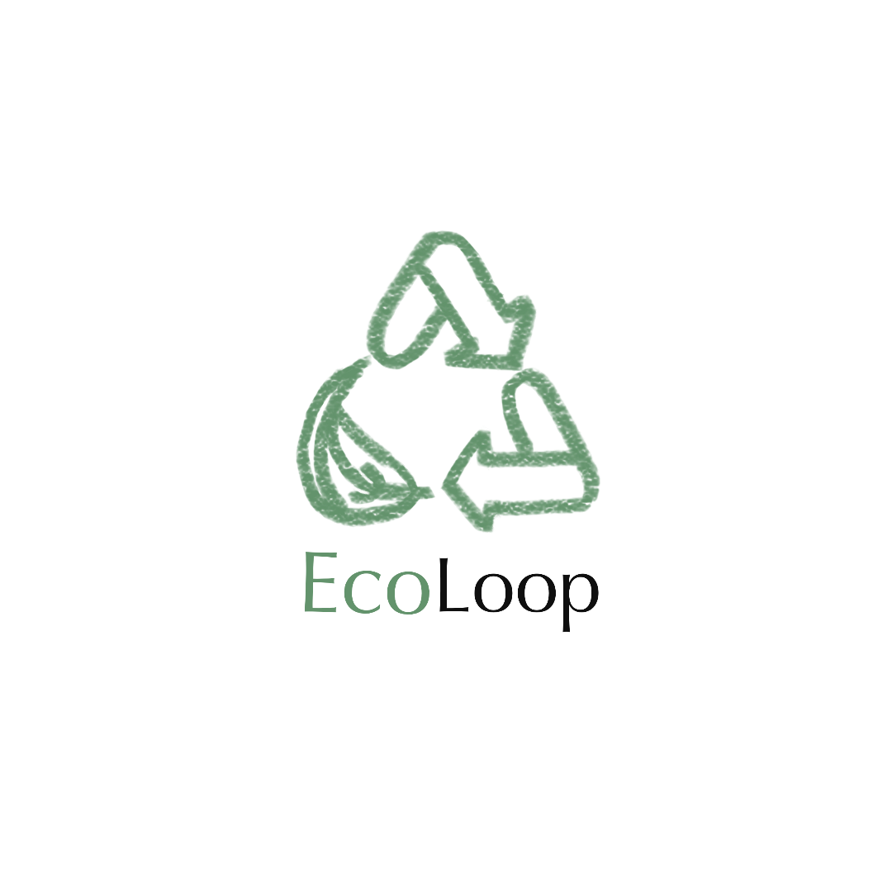
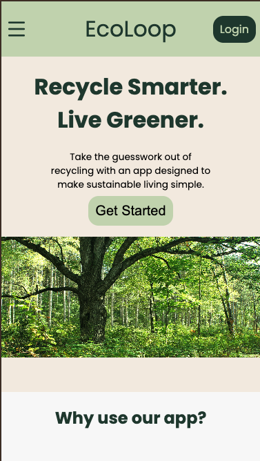
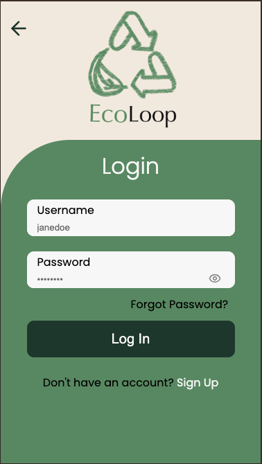
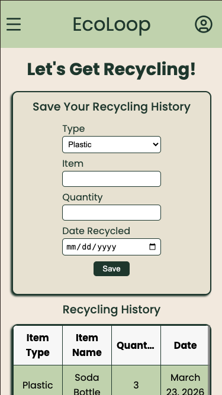
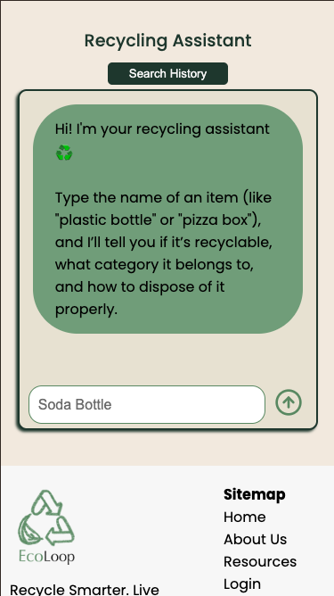

<p align='center'>
  
</p>

<!-- # ♻️ EcoLoop -->

A mobile-first full-stack web application designed to make recycling easier, smarter, and more accessible. This app helps users determine whether items can be recycled, track their recycling habits, and discover nearby recycling facilities—all with the support of an AI-powered assistant.

---

<p align='center'>
  
  
  
  
</p>

## Features

### AI Recycling Assistant

* Integrated with **Gamini AI** to provide real-time answers about recyclability.
* Users can ask about specific items (e.g., “Can I recycle a pizza box?”).
* Helps reduce confusion and improve proper recycling habits.

### Authentication

* Secure **login and signup** functionality.
* Personalized user experience with saved data and history.

### Recycling Tracking Dashboard

* Users can log items they have recycled.
* Visual insights through:

  * Graphs
  * Charts
* Track progress and build sustainable habits over time.

###  AI Chat History

* Stores previous AI queries.
* Prevents redundant API calls and improves efficiency.
* Users can revisit past questions and answers.

### Recycling Resources Locator

* Users can input their location to find nearby recycling facilities.
* Powered by:

  * **PositionStack API** (geocoding)
  * **Overpass API** (OpenStreetMap data)
* Makes it easy to take action locally.

---

## 🛠️ Tech Stack

### Frontend

* **React** (with **Vite**)
* Mobile-first responsive design
* Google Charts for data visualization

### Backend

* **Node.js**
* **Express.js**
* RESTful API architecture

### APIs & Integrations

* **Gamini AI** – recycling assistant
* **PositionStack API** – location geocoding
* **Overpass API** – nearby recycling facilities

---

## Mobile-First Design

This application was designed with a **mobile-first approach**, ensuring:

* Smooth performance on smartphones
* Responsive layouts for all screen sizes
* Intuitive and accessible UI/UX

---

## Project Structure

```
/client   → React + Vite frontend
/server   → Express backend API
```

---

## Installation & Setup

### 1. Clone the repository

```bash
git clone https://github.com/your-username/recycling-app.git
cd ecoloop
```

### 2. Install dependencies

#### Server

```bash
cd server
npm install
```

#### Client

```bash
cd ../client
npm install
```

### 3. Environment Variables

Create `.env` files in both `server` and `client` directories as needed.

Example variables:

```
GAMINI_API_KEY=your_api_key
POSITIONSTACK_API_KEY=your_api_key
```

### 4. Run the application

#### Start backend

```bash
cd server
npm run dev
```

#### Start frontend

```bash
cd client
npm run dev
```

---

<!-- ## 📈 Future Improvements

* Add user achievements or gamification
* Expand AI capabilities for more nuanced recycling rules
* Push notifications for recycling reminders
* Community features (sharing tips, stats)

--- -->

<!-- ## 🤝 Contributing

Contributions are welcome! Feel free to fork the repo and submit a pull request.

--- -->

## Author

#### [Renee Messersmith](https://www.linkedin.com/in/reneemessersmith/)

---

## License

This project is licensed under the MIT License.

---

## 🌱 Mission

To make recycling simpler, smarter, and more engaging through technology—empowering individuals to make environmentally responsible decisions every day.
